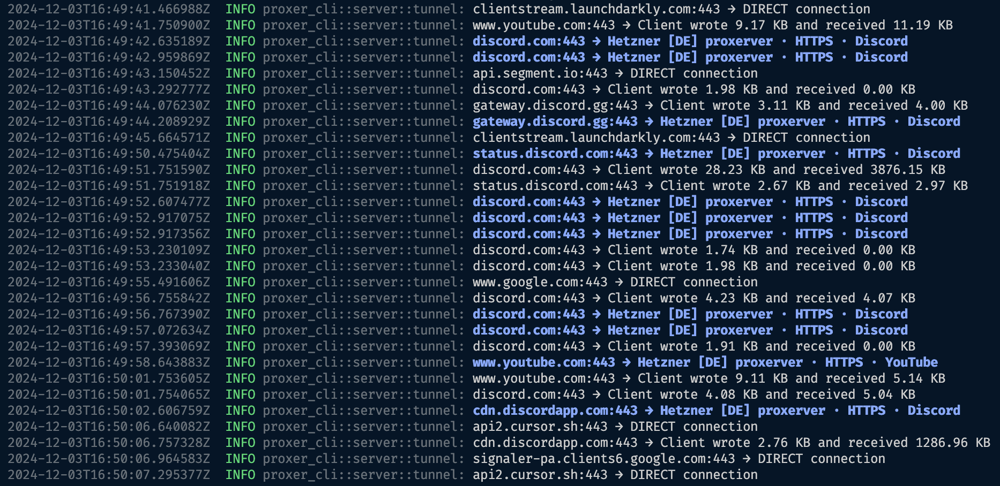

# Proxer

Network request proxy manager with host filtering on macOS + spoofDPI direct connections. Currently works only with IPv4 HTTP(S) proxies.



## How to Install

Just log into your macOS terminal and run the command:

```bash
curl -fsSL https://raw.githubusercontent.com/doroved/proxer/main/install.sh | bash
```
After installation, be sure to run this command to make proxer available in the current terminal session:

```bash
export PATH=$PATH:~/.proxer/bin
```
To update proxer to the latest version, use the same command that was used for installation.

## Key Features:
- Traffic filtering by hosts with caching.
- Basic SpoofDPI support.
- Setting secret token for [Proxerver](https://github.com/doroved/proxerver) to protect against proxy detection.

```
proxer --help

Proxy all macOS network requests with domain-based filtering. Basic spoof DPI for direct connections.

Usage: proxer [OPTIONS]

Options:
      --port <u16>       Set port for proxer. By default, a random port is used.
      --dpi              Enable DPI spoofing for direct connections. Spoofing is disabled by default.
      --config <string>  Path to the configuration file. Example: '/path/to/proxer.(json5|json)'. Default is ~/.proxer/config.json5.
      --token <string>   Secret token to access the HTTP/S proxerver. Must match the token specified in the proxerver configuration.
      --log-error-all    Show all errors. By default, only critical errors are shown. This option is useful for debugging.
  -h, --help             Print help
  -V, --version          Print version
```

The default configuration file is located in `~/.proxer/config.json5`. To edit it, you can quickly open it using the terminal command:

```bash
open -a TextEdit ~/.proxer/config.json5
```

If you want to use your own configuration file, you can specify it at startup using the `--config` flag.
For example, if you are in a directory with the config, you can run proxer as follows:

```bash
proxer --config ./config.json5
```
Configuration file structure:

```json5
[
  {
    "name": "Proxer Free [DE] proxerver",
    "enabled": true,
    "scheme": "HTTPS",
    "host": "proxerver.freemyip.com",
    "port": 443,
    "auth_credentials": {
      "username": "proxerver",
      "password": "onelove"
    },
    "filter": [
      {
        "name": "YouTube",
        "domains": ["*.youtube.com", "*.googlevideo.com", "*.ggpht.com"]
      },
      {
        "name": "Discord",
        "domains": [
          "discord.com",
          "*.discord.com",
          "*.discordapp.com",
          "discord-attachments-*.storage.googleapis.com",
          "*.discordapp.net",
          "gateway.discord.gg"
        ]
      },
      {
        "name": "Test",
        "domains": ["api.ipify.org"]
      }
    ]
  }
]
```
If your proxies don't require authentication, you can leave the `auth_credentials.username` and `auth_credentials.password` fields empty.

## Examples of Proxer Launch Commands

Set port 5555 for the local Proxer server.

```bash
proxer --port 5555
```

Enable basic DPI bypass.
```bash
proxer --dpi
```

Set the secret token that was set when starting the `Proxerver` proxy server. This will allow the proxy server to accept requests only from your client.
```bash
proxer --token 'HelloProxerver'
```

Enable display of all proxy server connection errors.
```bash
proxer --log-error-all
```

To run the Proxer in the background, use nohup, for example:

```bash
nohup proxer [OPTIONS] >/dev/null 2>&1 &
```

Running the Proxer in the background using nohup and saving the output to a file:

```bash
nohup proxer [OPTIONS] > ~/.proxer/log.txt 2>&1 &
```

## Local Build and Run

1. Clone the repository.

```bash
git clone https://github.com/doroved/proxer.git
```

2. Run `cargo build --release` to build the binary.

```bash
cargo build --release
```

3. Run the Proxer binary with configuration.

```bash
./target/release/proxer --config 'proxer.dev.json5'
```

4. Or run it in background process using `nohup`.

```bash
nohup ./target/release/proxer --config 'proxer.dev.json5' >/dev/null 2>&1 &
```

5. To stop Proxer, run this command.

```bash
kill $(pgrep proxer)
```

6. See Proxer running on your machine
```bash
lsof -i -P | grep LISTEN | grep proxer
```

## Interesting projects

- [DumbProxy](https://github.com/SenseUnit/dumbproxy) - Great proxy server with various features
- [SpoofDPI](https://github.com/xvzc/SpoofDPI) - macOS
- [GoodbyeDPI](https://github.com/ValdikSS/GoodbyeDPI) - Windows
- [ByeDPI](https://github.com/hufrea/byedpi) - Windows, Linux
